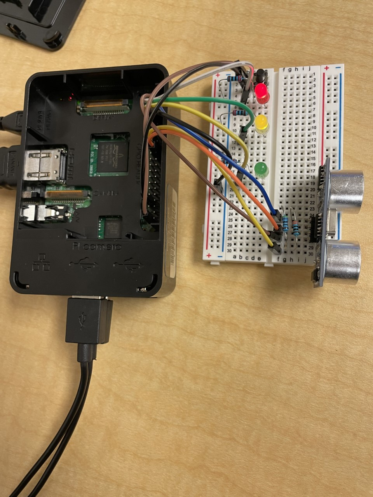

# Final-Project

These are the step by step instructions to make a system using a breadboard and Rasberry Pi. What this sytem does is uses a distance sensor to light up different LED lights depending how far away they are from the distance sensor. Also after starting up python a button is needed to start the system.

The needed materials will be:
 - Rasberry Pi
 - Breadboard
 - Button
 - Distance Sensor
 - Eight male-to-female jumper cables
 - Three LED lights
 - Five resistors

Here is a final look at the system when it is all connected:

